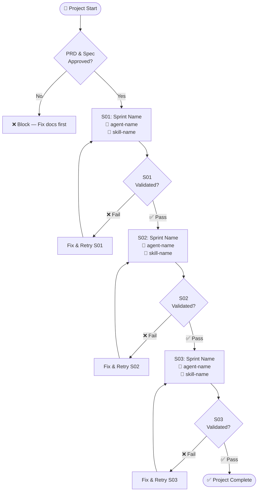
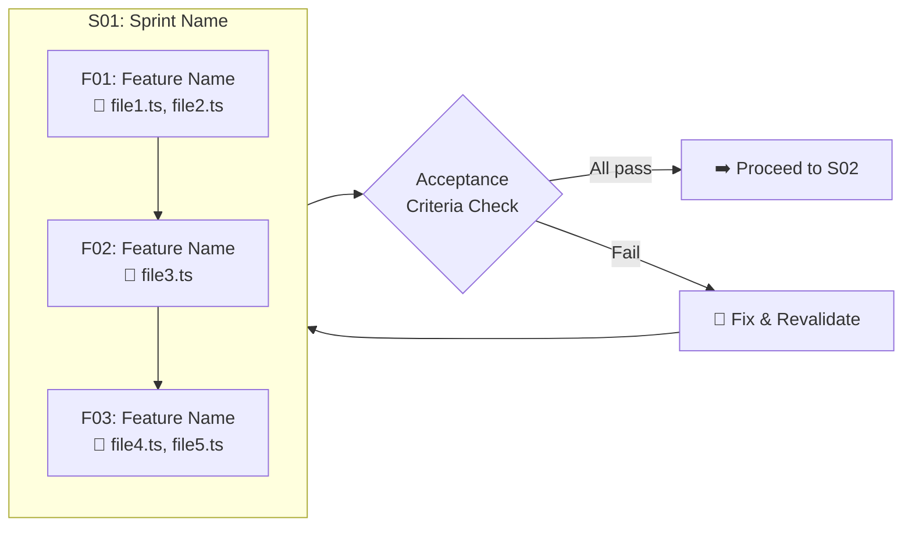
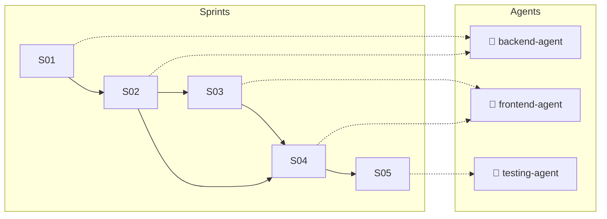
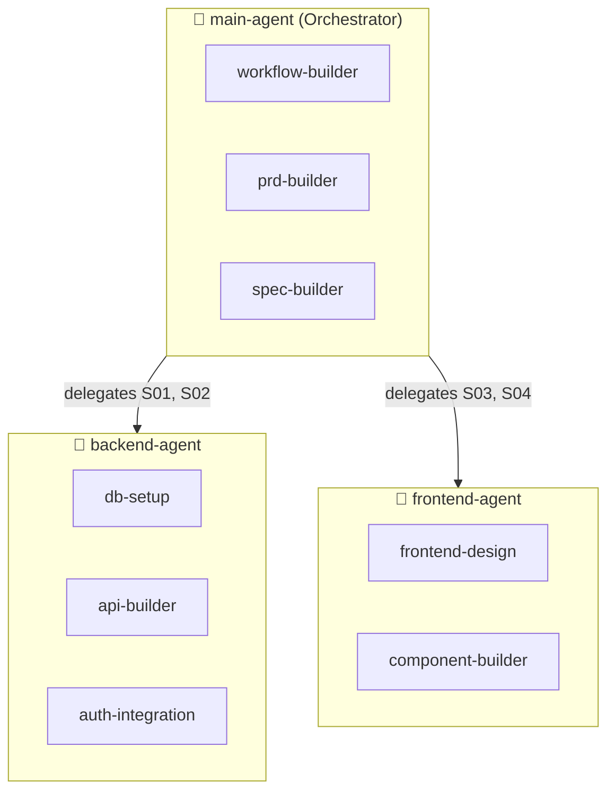

# Workflow Builder

Transforms approved PRDs and Specs into two executable orchestration documents: a **visual workflow map** (`workflows.md`) and a **task tracker** (`tasks.md`). These documents are the operating system of the main orchestrator agent — they define *who does what, when, and how to track it*.

## When to Use This Skill

- User has an approved PRD **and** an approved Spec and wants to start execution
- User says "create workflow", "build workflow", "orchestration plan"
- User says "generate tasks", "create task tracker", "task list from spec"
- User wants to map sprints/features to specific sub-agents and their skills
- User needs a visual (Mermaid) representation of the project execution flow
- The main agent needs a delegation plan before starting to code

## When NOT to Use

- User needs to **define** what to build (product/business) — use `prd-builder`
- User needs to **design** how to build it (technical) — use `spec-builder`
- User wants to fix a single bug or make a trivial change
- User already has workflows and tasks and wants to start coding

---

## Core Principles

1. **Workflow ≠ Spec.** The Spec defines *what* to build technically. The Workflow defines *who builds it, in what order, and how to track progress*. Never duplicate Spec content — reference it.
2. **Validate before generating.** Before assigning a sub-agent or skill, verify it exists in the workspace or global skills directory. Flag missing agents/skills for the user to create first.
3. **Mermaid-first visualization.** Every workflow must include Mermaid diagrams. Visual orchestration prevents misunderstanding of execution order and dependencies.
4. **tasks.md is a living document.** It must be updated by the main agent after every completed task. This is a hard rule — never skip updates.
5. **One sprint at a time.** The main agent delegates one sprint at a time, validates completion, then moves to the next. The workflow enforces this sequential discipline.
6. **Clean context per sprint.** Each sub-agent should receive only its sprint context, not the entire project history.

---

## Workflow

### Phase 1: Input Collection

#### Step 1.1 — Locate PRD and Spec

Request or locate both documents:

1. **PRD** — `docs/PRD-[project-name].md` or user-specified path
2. **Spec** — `docs/SPEC-[project-name].md` or user-specified path

If either document is missing:
- Missing PRD → redirect to `prd-builder`
- Missing Spec → redirect to `spec-builder`
- Both missing → start with `prd-builder`

#### Step 1.2 — Extract Key Data from Spec

From the Spec, extract:

| Data | Source Section | Purpose |
|------|---------------|---------|
| Sprint list (S01, S02...) | §1 Sprints | Workflow stages |
| Features per sprint (F01, F02...) | §2 Features | Task granularity |
| Acceptance criteria | §3 Acceptance Criteria | Completion validation |
| Agent assignments (if any) | §7 Agent Assignment | Sub-agent mapping |
| Sprint dependencies | §1 Sprints (Dependencies) | Execution order |
| File mapping per sprint | §8 File Structure | Scope per delegation |
| Stack/technologies | §6 Stack | Skill requirements |

#### Step 1.3 — Extract Key Data from PRD

From the PRD, extract:

| Data | Source Section | Purpose |
|------|---------------|---------|
| User stories | §5 User Stories | Traceability |
| Scope boundaries | §4 Scope Definition | Guardrails |
| Business rules | §7 Business Rules | Constraints |
| Timeline/milestones | §13 Timeline | Deadlines |

---

### Phase 2: Agent & Skill Validation

> ⚠️ **This phase is mandatory.** Never generate a workflow that references non-existent agents or skills.

#### Step 2.1 — Inventory Available Agents

Scan the workspace and the configured Codex skill locations for existing agent configurations and instructions:

**Scan locations:**
- `<workspace-root>/AGENTS.md` — project instructions and operating constraints
- `<workspace-root>/.agents/` and `<workspace-root>/.codex/` — workspace agent or Codex configuration, when present
- Configured Codex skill directories — reusable installed skills

**For each agent referenced in the Spec (§7), verify:**
- [ ] Agent configuration exists
- [ ] Agent has the required skills assigned
- [ ] Agent's skill set covers the sprint's technical needs

#### Step 2.2 — Inventory Available Skills

List all skills found in the scan. Cross-reference against the Spec's requirements:

```markdown
| Required Capability | Matching Skill | Status |
|---------------------|---------------|--------|
| Database setup | spec-builder | ✅ Exists |
| UI components | frontend-design | ✅ Exists |
| API testing | — | ❌ Missing |
| Auth integration | — | ❌ Missing |
```

#### Step 2.3 — Gap Report

If any agents or skills are missing, generate a **Gap Report** and present it to the user before proceeding:

```markdown
## ⚠️ Gap Report: Missing Agents/Skills

### Missing Skills
1. **api-testing** — needed for S03 (API validation)
   - Recommendation: Create skill with `skill-creator` or assign manually
2. **auth-integration** — needed for S02 (Authentication)
   - Recommendation: Create skill or use existing provider docs

### Missing Agents
1. **testing-agent** — referenced in Spec §7 for S05
   - Recommendation: Create agent config before workflow generation

### Action Required
Resolve all gaps before proceeding. The workflow will not be generated with unresolved references.
```

If the Spec does not define agents (single-agent execution), skip agent validation and assign all tasks to the **main agent**.

Before assigning work, confirm the project stack from its tracked configuration and lockfiles. A skill is a match only when its instructions and available tools support the stack actually detected.

#### Step 2.4 — Agent/Skill Resolution

Once all gaps are resolved (user creates missing items or reassigns tasks), confirm the final mapping:

```markdown
## ✅ Agent/Skill Resolution — Confirmed

| Agent | Skills | Sprints |
|-------|--------|---------|
| main-agent | prd-builder, spec-builder, workflow-builder | Orchestration |
| backend-agent | db-setup, api-builder, auth-integration | S01, S02 |
| frontend-agent | frontend-design, component-builder | S03, S04 |
| testing-agent | api-testing, e2e-testing | S05 |
```

---

### Phase 3: Workflow Generation (`workflows.md`)

#### Step 3.1 — Document Header

```markdown
# Workflows: [Project Name]

> **Version:** 1.0
> **Date:** YYYY-MM-DD
> **Status:** Draft | Approved
> **PRD Reference:** [path/filename]
> **Spec Reference:** [path/filename]
> **Generated by:** workflow-builder skill

---
```

#### Step 3.2 — High-Level Orchestration Diagram

Generate a Mermaid flowchart showing the complete project flow from start to finish:

```markdown
## 1. Orchestration Overview


```

> Adapt the diagram dynamically based on the actual sprints in the Spec. Include parallel paths for sprints that can run concurrently (no dependency between them).

#### Step 3.3 — Sprint Detail Diagrams

For **each sprint**, generate a detailed sub-diagram showing the internal task flow:

```markdown
## 2. Sprint Details

### S01: [Sprint Name]

**Agent:** 🤖 [agent-name]
**Skills:** 🔧 [skill-1], [skill-2]
**Dependencies:** None
**Goal:** [from Spec]



#### Delegation Payload

The main agent will send this context to the sub-agent:

| Field | Value |
|-------|-------|
| **Sprint** | S01 |
| **Goal** | [goal from Spec] |
| **Features** | F01, F02, F03 |
| **Files to create/modify** | [from Spec §8] |
| **Acceptance Criteria** | [from Spec §3] |
| **Tech Stack** | [from Spec §6] |
| **Business Rules** | [from PRD §7 — only relevant ones] |
| **Scope Guardrails** | [from PRD §4.2 — Out of Scope] |
```

Repeat this block for every sprint.

#### Step 3.4 — Dependency Graph

Generate a comprehensive dependency visualization:

```markdown
## 3. Dependency Graph


```

#### Step 3.5 — Agent Skill Map

```markdown
## 4. Agent × Skill Matrix


```

#### Step 3.6 — Orchestration Rules

Append execution rules for the main agent:

```markdown
## 5. Orchestration Rules

1. **Sequential execution.** Execute sprints in dependency order. Never start S(N+1) before S(N) passes validation.
2. **Clean context per sprint.** Each sub-agent receives ONLY its sprint's delegation payload. Do not send full project history.
3. **Validate before advancing.** After each sprint, run all acceptance criteria. If any fail, retry the sprint before proceeding.
4. **Update tasks.md after every task.** The main agent MUST update `tasks.md` when a task starts, completes, or fails.
5. **Scope enforcement.** If a sub-agent attempts work outside its sprint scope, reject and re-delegate.
6. **Cross-Audit Validation.** Sprints involving UI or Integrations MUST pass an automated validation script (e.g., `validate:code`) or an independent auditor agent (e.g., `gsd-ui-checker`) before the sprint can be marked complete.
7. **Retry limit.** Maximum 3 retries per sprint. After 3 failures, escalate to the user.
8. **Progress checkpoints.** After every 2 sprints, summarize progress to the user and ask for confirmation to continue.
```

---

### Phase 4: Task Tracker Generation (`tasks.md`)

#### Step 4.1 — Generate tasks.md

Create the task tracker from the Spec's sprints and features:

```markdown
# Tasks: [Project Name]

> **Version:** 1.0
> **Date:** YYYY-MM-DD
> **Last Updated:** YYYY-MM-DD HH:MM
> **Status:** In Progress | Completed | Blocked
> **PRD Reference:** [path/filename]
> **Spec Reference:** [path/filename]
> **Workflow Reference:** [path/filename]

---

## Progress Summary

| Metric | Value |
|--------|-------|
| Total Sprints | X |
| Completed Sprints | 0 |
| Total Tasks | Y |
| Completed Tasks | 0 |
| Current Sprint | — |
| Overall Progress | 0% |

---

## Sprint Tracker

### S01: [Sprint Name]
**Agent:** 🤖 [agent-name]
**Status:** ⬜ Not Started | 🟡 In Progress | ✅ Completed | ❌ Failed | 🔄 Retrying
**Started:** —
**Completed:** —
**Retries:** 0/3

| # | Task | Feature | Status | Started | Completed | Notes |
|---|------|---------|--------|---------|-----------|-------|
| 1 | [Task description] | F01 | ⬜ | — | — | |
| 2 | [Task description] | F01 | ⬜ | — | — | |
| 3 | [Task description] | F02 | ⬜ | — | — | |
| 4 | [Task description] | F03 | ⬜ | — | — | |

**Acceptance Criteria:**
- [ ] [Criterion from Spec §3]
- [ ] [Criterion from Spec §3]
- [ ] [Criterion from Spec §3]

---

### S02: [Sprint Name]
(repeat pattern for all sprints)

---

## Update Log

| Timestamp | Sprint | Task | Action | Details |
|-----------|--------|------|--------|---------|
| — | — | — | — | — |

---

## Blocked Items

| Item | Sprint | Reason | Since | Resolution |
|------|--------|--------|-------|------------|
| — | — | — | — | — |
```

#### Step 4.2 — Update Protocol

Include this protocol at the top of `tasks.md` as an instruction block for the main agent:

```markdown
<!-- AGENT INSTRUCTION: UPDATE PROTOCOL
This file is a LIVING DOCUMENT. The main orchestrator agent MUST update it following these rules:

1. WHEN STARTING A SPRINT:
   - Set sprint Status to 🟡 In Progress
   - Set Started timestamp
   - Update Current Sprint in Progress Summary

2. WHEN STARTING A TASK:
   - Set task Status to 🟡
   - Set Started timestamp
   - Add entry to Update Log

3. WHEN COMPLETING A TASK:
   - Set task Status to ✅
   - Set Completed timestamp
   - Increment Completed Tasks in Progress Summary
   - Recalculate Overall Progress percentage
   - Add entry to Update Log

4. WHEN A TASK FAILS:
   - Set task Status to ❌
   - Add failure details to Notes column
   - Add entry to Update Log
   - Increment sprint Retries counter

5. WHEN COMPLETING A SPRINT:
   - Verify ALL acceptance criteria are checked ✅
   - Set sprint Status to ✅
   - Set Completed timestamp
   - Increment Completed Sprints in Progress Summary
   - Add entry to Update Log

6. WHEN A SPRINT FAILS (3 retries exceeded):
   - Set sprint Status to ❌
   - Add to Blocked Items table
   - STOP execution and notify user

7. TIMESTAMP FORMAT: YYYY-MM-DD HH:MM (24h, local time)

NEVER skip an update. Missing updates break orchestration tracking.
-->
```

---

### Phase 5: Validation & Handoff

#### Step 5.1 — Cross-Validation Checklist

Before presenting to the user, verify:

- [ ] Every sprint from the Spec appears in `workflows.md`
- [ ] Every feature from the Spec appears as a task in `tasks.md`
- [ ] Every agent referenced exists (validated in Phase 2)
- [ ] Every skill referenced exists (validated in Phase 2)
- [ ] Mermaid diagrams render correctly (no syntax errors)
- [ ] Sprint dependencies in the diagram match the Spec
- [ ] Acceptance criteria in `tasks.md` match the Spec §3
- [ ] Delegation payloads contain all required context
- [ ] Orchestration rules are complete and unambiguous
- [ ] Update protocol is embedded in `tasks.md`

#### Step 5.2 — Present to User

1. Present both documents to the user
2. Highlight any agent/skill gaps that were resolved
3. Show the high-level orchestration diagram for quick understanding
4. Ask: *"Are the agent assignments, task breakdown, and execution flow correct?"*
5. Iterate until approved

#### Step 5.3 — Handoff

Once approved, advise the user:

> **How to use these documents:**
> 1. The main agent reads `workflows.md` to understand the full execution plan
> 2. The main agent opens `tasks.md` to track progress
> 3. For each sprint, the main agent:
>    a. Reads the sprint's delegation payload from `workflows.md`
>    b. Opens a **clean context** and sends the payload to the assigned sub-agent
>    c. Validates the sub-agent's output against acceptance criteria
>    d. Updates `tasks.md` with the results
>    e. Proceeds to the next sprint or retries on failure
> 4. After all sprints complete, the main agent marks the project as done in `tasks.md`

---

## Best Practices

### For the Agent

1. **Always validate agents/skills first.** A workflow referencing non-existent agents is useless and dangerous — the main agent will fail at delegation time.
2. **Keep Mermaid diagrams readable.** Use subgraphs for grouping, consistent node naming, and emoji prefixes (🤖 agent, 🔧 skill, 📁 files) for quick scanning.
3. **Break tasks to the feature level.** Each row in `tasks.md` should map to exactly one feature from the Spec. Don't go more granular (sub-tasks) or less granular (entire sprints as single rows).
4. **Include delegation payloads.** The main agent needs a copy-paste-ready context block for each sprint. Don't make it assemble context from multiple sources.
5. **Embed the update protocol.** Use HTML comments in `tasks.md` so the main agent always has the update rules in context when it reads the file.
6. **Diagram parallel sprints.** If the Spec allows sprints to run in parallel (no dependency between them), show parallel paths in the orchestration diagram.
7. **Match the user's language.** Portuguese docs → Portuguese workflows and tasks.

### For the User

1. **Review the gap report carefully.** Missing agents/skills must be created before the workflow is reliable.
2. **Approve both documents together.** The workflow and task tracker are tightly coupled — changes to one affect the other.
3. **Don't manually edit `tasks.md` during execution.** Let the main agent own updates. Manual edits risk desynchronization.
4. **Use progress checkpoints.** After every 2 sprints, review the update log for anomalies.

---

## Decision Tree

```
1. Does the user have an approved PRD?
   ├─ Yes → Continue to step 2
   └─ No  → Redirect to prd-builder

2. Does the user have an approved Spec?
   ├─ Yes → Continue to step 3
   └─ No  → Redirect to spec-builder

3. Are all referenced agents and skills available?
   ├─ Yes → Continue to Phase 3 (Workflow Generation)
   └─ No  → Generate Gap Report, wait for resolution

4. Is this a single-agent or multi-agent project?
   ├─ Single → Assign all tasks to main agent, simplify diagrams
   └─ Multi  → Full agent/skill matrix and delegation payloads

5. Are both documents approved by the user?
   ├─ Yes → Save and guide handoff
   └─ No  → Iterate on feedback
```

---

## Output Conventions

- **Workflow file:** `WORKFLOW-[project-name].md` (kebab-case)
- **Task tracker file:** `TASKS-[project-name].md` (kebab-case)
- **Location:** Project root `docs/` folder, or as specified by the user
- **Format:** Markdown (`.md`) with embedded Mermaid
- **Language:** Match the user's language (Portuguese if user writes in PT, English if EN, etc.)
- **Encoding:** UTF-8

---

## Pipeline Position

This skill is the **third step** in the AI-assisted development pipeline:

```
PRD (prd-builder) → Spec (spec-builder) → Workflow + Tasks (workflow-builder) → Code Execution
     Context 1           Context 2                Context 3                       Context 4+
```

Each step runs in a **clean context window** to prevent LLM context degradation.
